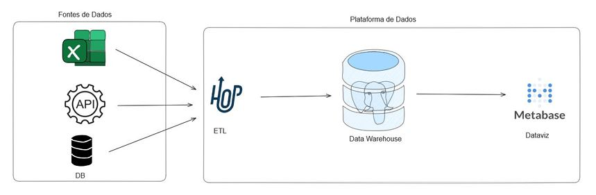
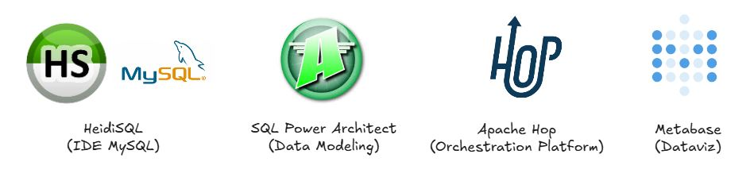
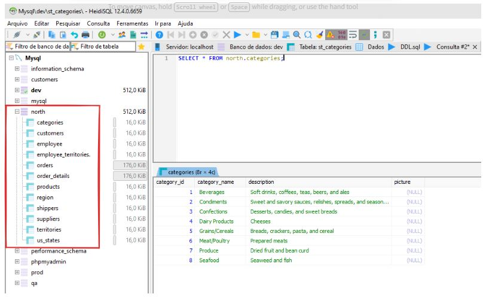
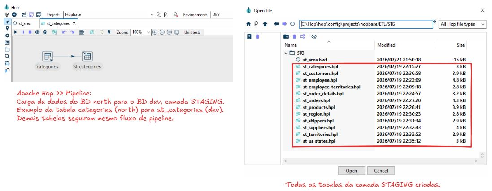
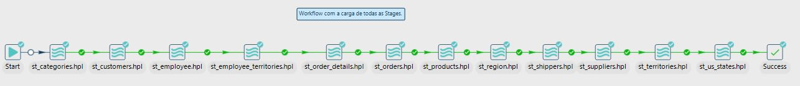
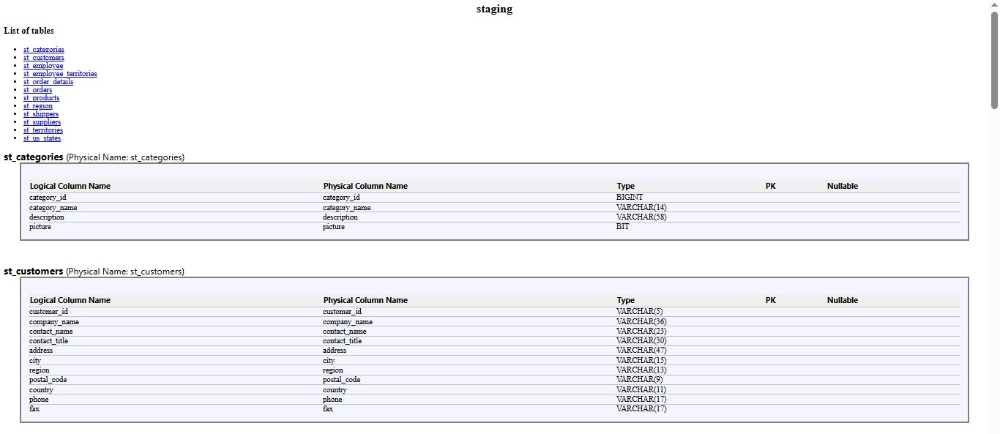

# Projeto HOPBASE
Solução de Business Intelligence (BI) 100% open source, utilizando soluções gratuitas e robustas. Processo de ETL com [Apache Hop](https://hop.apache.org/) e Dataviz com [Metabase](https://www.metabase.com/). 

## 01. Arquitetura do Projeto

## 02. Preparação do Ambiente
Passo-a-passo detalhado: [Projeto Hopbase](https://hotmart.com/pt-BR/club/formacao-pentarruda/products/5599808/content/r488xZ2n4R?track=Pb4K0mLbeX).

### 📌 Banco de Dados
Uniserver: Banco de Dados MySQL.  
Unicontroller: Software para ativar o banco de dados.  
HeidiSQL: IDE para desenvolvimento.  

### 📌 Java
Criar variável de ambiente (JAVA_HOME).

### 📌 Apache Hop (Hop Orchestration Platform)
É uma plataforma de código aberto voltada para a engenharia, integração e orquestração de dados e metadados.  
Instalar o software [Apache Hop](https://hop.apache.org/download/).  
Realizar conexão do Apache Hop com o Banco de Dados (Drive de conexão do MySQL).

### 📌 Metabase
Ferramenta de Business Intelligence (BI) e análise de dados de código aberto (open source). Permite conectar com bancos de dados e criar gráficos, métricas e painéis visuais (dashboards).  
Instalar o software [Metabase](https://www.metabase.com/docs/latest/installation-and-operation/running-the-metabase-jar-file
).  
Seguir orientações da documentação do Metabase.

### 📌 SQL Power Architect
Ferramenta gráfica e de código aberto voltada para a **modelagem de bancos de dados e design de Data Warehouses**.  
Instalar o software SQL Power Architect.

### 📌 Resumo Tecnologias

## 03. Banco de Dados do Projeto: "north"
Criar Banco de Dados (north) no HeidiSQL ("Rodar" arquivo DDL.sql).  
Também foi criado os BDs: dev, qa, prod.
Ilustração BD north abaixo (12 tabelas):  

## 04. Staging Area (Criação e Carga de dados)
- Através do SQL Power Architect, foram criadas das tabelas da camada STAGING, no banco de dados "dev".  
- Apache Hop: Desenvolvimento dos PIPELINES para carga de dados de cada tabela na camada STAGING.  
- Apache Hop: Desenvolvimento de WORKFLOW para carga completa e simultânea dos dados na camada STAGING.  
PIPELINES
   
WORKFLOW
  

- Documentação das tabelas da camada STAGING, gerado através do SQL Power Architect:
