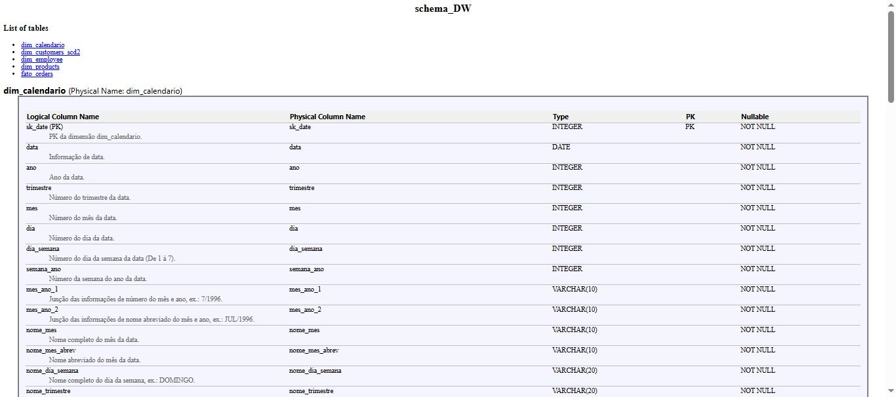
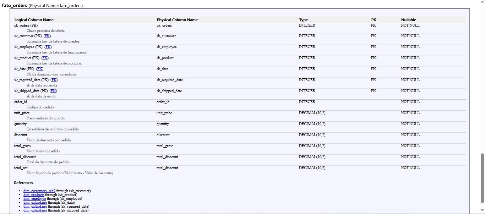
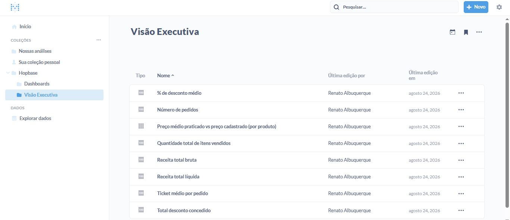
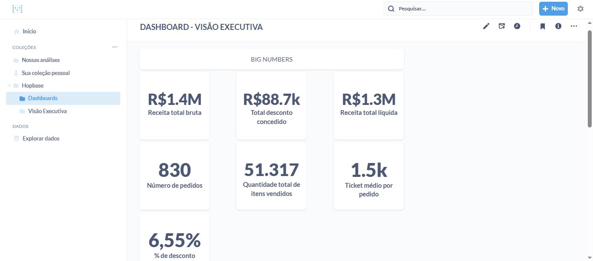
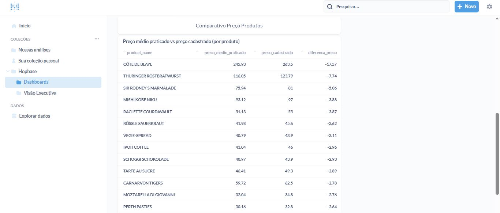
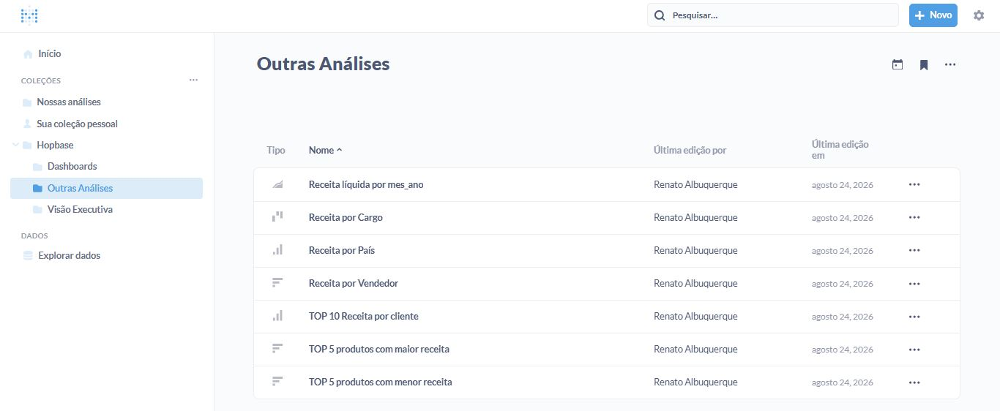
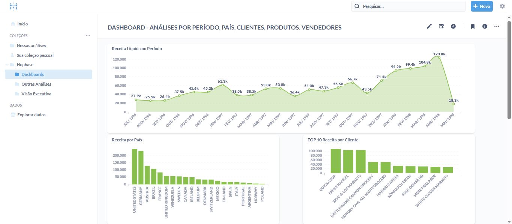
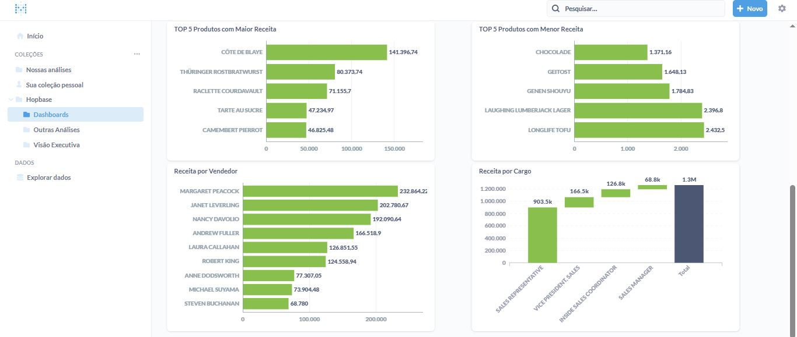

# Projeto HOPBASE
Solução de Business Intelligence (BI) 100% open source, utilizando soluções gratuitas e robustas. Processo de ETL com [Apache Hop](https://hop.apache.org/) e Dataviz com [Metabase](https://www.metabase.com/). <br>

Time envolvido: <br>
[Renato Albuquerque](https://www.linkedin.com/in/renato-malbuquerque/) <br>
[Rafael Arruda](https://www.linkedin.com/in/rafael-arruda-39145738/) <br>
[Arruda Data Consulting](https://arrudaconsulting.com.br/) <br>

## 01. Arquitetura do Projeto


## 02. Preparação do Ambiente
Passo-a-passo detalhado: [Projeto Hopbase](https://hotmart.com/pt-BR/club/formacao-pentarruda/products/5599808/content/r488xZ2n4R?track=Pb4K0mLbeX).

### 📌 Banco de Dados
Uniserver: Banco de Dados MySQL. <br>
Unicontroller: Software para ativar o banco de dados. <br>
HeidiSQL: IDE para desenvolvimento. <br>

### 📌 Java
Tanto o Apache Hop quanto o Metabase são aplicações Java, portanto é necessário ter o JDK/JRE instalado no ambiente. <br>
Pré-requisito: Java (JDK 11+), necessário para executar Apache Hop e Metabase. <br>
Criar variável de ambiente (JAVA_HOME) >> Vincular com o diretório: C:\Program Files\Java\jdk-11

### 📌 Apache Hop (Hop Orchestration Platform)
É uma plataforma de código aberto voltada para a engenharia, integração e orquestração de dados e metadados. <br>
Instalar o software [Apache Hop](https://hop.apache.org/download/). <br>
Obs.: Para abrir a interface gráfica, execute o arquivo `hop-gui.bat`, localizado na pasta de instalação. <br>
Para permitir a conexão com bancos MySQL, copie o driver JDBC `mysql-connector-java-5.1.44-bin.jar` para a pasta `C:\Hop\hop\lib\beam` (diretório de instalação do Apache Hop). <br>
Para conectar o Apache Hop ao banco de dados, acesse **Metadata > Relational Database Connection** e preencha os campos com as informações de conexão (host, porta, banco, usuário e senha).

### 📌 Metabase
Ferramenta de Business Intelligence (BI) e análise de dados de código aberto (open source). Permite conectar com bancos de dados e criar gráficos, métricas e painéis visuais (dashboards). <br>
Instalar o software [Metabase](https://www.metabase.com/docs/latest/installation-and-operation/running-the-metabase-jar-file
). <br>
Este projeto executa o Metabase a partir do arquivo `metabase.jar` (versão Open Source). <br>
Seguir orientações da documentação do Metabase.
Obs.: Para acessar a ferramenta, acesse em: http://localhost:3000/setup

### 📌 SQL Power Architect
Ferramenta gráfica e de código aberto voltada para a **modelagem de bancos de dados e design de Data Warehouses**. <br>
Instalar o software SQL Power Architect. <br>
Para permitir a conexão com bancos MySQL, copie o driver JDBC `mysql-connector-java-5.1.44-bin.jar` para o diretório de instalação do SQL Power Architect. Passo similar ao realizado no Apache Hop. <br>
Conectar o SQL Power Architect ao Banco de Dados: Acesse **Connection > Add Source > New Connection** e preencha os campos com as informações do banco de dados (nome da conexão, tipo, host, porta, database, usuário e senha).

### 📌 Resumo Tecnologias


## 03. Banco de Dados do Projeto: "north"
📝 Criar Banco de Dados (north) no HeidiSQL ("Rodar" arquivo DDL.sql). <br>
📝 Também foi criado os BDs: dev, qa, prod. <br>
📝 Ilustração BD north abaixo (12 tabelas): <br>


## 04. Staging Area (Criação e Carga de dados)
📝 Através do SQL Power Architect, foram criadas as tabelas da camada STAGING, no banco de dados "dev". <br>
Obs.: O SQL Power Architect foi utilizado como ferramenta gráfica de modelagem, permitindo criar as tabelas da Staging Area de forma visual, sem escrever as queries manualmente. <br>
📝 Documentação das tabelas da camada STAGING, gerado através do SQL Power Architect:

📝 Apache Hop: Desenvolvimento dos PIPELINES para carga de dados de cada tabela na camada STAGING (BD de produção: north, para BD de desenvolvimento: "dev"). <br>
Etapa de "popular os dados" nas tabelas da STAGING Area. <br> 
📝 Apache Hop: Desenvolvimento de WORKFLOW para carga completa e simultânea dos dados na camada STAGING. <br>
PIPELINES
 <br> 
WORKFLOW
 <br>

## 05. Data Warehouse (DW)
📝 MySQL / HeidiSQL: Desenvolvimento da tabela FATO ft_orders (INNER JOIN entre as tabelas dev.st_orders & dev.st_order_details) <br>

```
SELECT
	o.order_id,
	o.customer_id AS sk_customer,
	o.employee_id AS sk_employee,
	od.product_id AS sk_product,
	o.order_date,
	o.required_date,
	o.shipped_date,
	od.unit_price,
	od.quantity,
	od.discount,
	ROUND(od.unit_price * od.quantity, 2) AS valor_bruto,
	ROUND((od.unit_price * od.quantity) * od.discount, 2) AS valor_desconto,
	ROUND((od.unit_price * od.quantity) - ((od.unit_price * od.quantity) * od.discount), 2) AS valor_liquido
FROM dev.st_orders o
INNER JOIN dev.st_order_details od
ON o.order_id = od.order_id;
```

📝 Através do SQL Power Architect, foram criadas as tabelas DIMENSÕES e FATO da camada DW, no banco de dados "dev" (Como base para criação, foram utilizadas as tabelas da STAGING Area, st_customers, st_employee, st_products, st_orders, st_order_details). <br>
Ob.: A tabela ft_orders foi criada através da junção entre st_orders, st_order_details. <br>


📝 Documentação das tabelas da camada DW, gerado através do SQL Power Architect:


🌟 Dimensão dim_customer <br>
Para a dim_customer, será apresentado 02 abordagens para carga dos dados: <br>
Carga Full x Carga SCD2 (Slowly Changing Dimension Tipo 2) <br>

✅ **Carga Full (Carga Completa):** Apaga e substitui todos os dados antigos a cada atualização. <br>

**Pipeline para carga full (Apache Hop)** <br>


✅ **Carga SCD2:** Método de modelagem de dados usado para guardar o histórico de alterações em tabelas dimensionais. <br>
Obs.: Utilização deste método (SCD2) em dimensões estratégicas. <br>

1ª Etapa: Simulando atualização no bd produção (north), tabela customers. <br>
 <br>

2ª Etapa: Executar o workflow no apache hop st_area (Workflow com a carga de todas as stages). <br>
 <br>

3ª Etapa: **Pipeline para carga scd2 (Apache Hop)** <br>
 <br>

🌟 Dimensão dim_employee <br>
**Pipeline para carga full (Apache Hop)** <br>
 <br>

🌟 Dimensão dim_products <br>
**Pipeline para carga full (Apache Hop)** <br>
 <br>

🌟 Dimensão dim_calendario <br>
Tabela desenvolvida no Apache Hop. <br>
No exemplo deste projeto, como boa prática, desenvolver a dim_calendario no Apache Hop ou no banco de dados DW (SQL) <br>
**Pipeline para carga full (Apache Hop)** <br>
 <br>

📝 Obs. Staging Area: Implementar a Staging da Tabela FATO. <br>
Através do SQL Power Architect, foi criada a tabela FATO na camada STAGING, st_fato_orders (A partir das tabelas: st_orders, st_order_details), no banco de dados "dev". <br>
Para suportar a tabela na camada DW, fato_orders. <br>


📝 Apache Hop: Desenvolvimento do PIPELINE para carga de dados da tabela st_fato_orders na camada STAGING. <br>


🌟 Tabela fato_orders <br>
Tabela desenvolvida no Apache Hop. <br>
(Lookups tabela st_fato_orders com: dim_customer_scd2, dim_employee, dim_products, dim_calendario. Para trazer as colunas sk's). <br>
**Pipeline para carga full (Apache Hop)** <br>
 <br>

Modelagem DW atualizada: <br>
 <br>

### CARGA INCREMENTAL

🌟 Dimensão dim_products <br>


📝 Simulação alteração de dado. Alteração no BD de produção, tabela products, coluna units_in_stock (north.products). <br> 


📝 Apache Hop: Rodar o WORKFLOW staging area (st_area). <br>
📝 Apache Hop: Rodar o PIPELINE dim_products (carga_incremental). <br>


🌟 Dimensão dim_employee <br>
Outro método para carga incremental, utilizando apenas o step Synchronize after merge. <br>


🌟 Dimensão dim_calendario_dinamica <br>
Outra forma para desenvolvimento da dim_calendario, de forma dinâmica, considerando a data mínima e data máxima, tabela st_orders. <br>


🌟 Dimensão dim_customer_scd2 <br>
Concluída na seção anterior.

### AJUSTANDO DOCUMENTAÇÃO DO DATA WAREHOUSE (DW) 

📝 Atualizando informações das tabelas DIMENSÃO na ferramenta SQL Power Architect.


📝 Criar WORKFLOW das tabelas dimensões. 


📝 Criar WORKFLOW da tabela fato.


📝 WORKFLOW geral para o DW.


📝 Documentação atualizada das tabelas da camada DW, gerado através do SQL Power Architect. Exemplo das tabelas dim_calendario e fato_orders:
 <br>
 <br>

## 06. Data Vizualization (Metabase)
Informações sobre instalação da ferramenta na etapa 02 - Preparação do Ambiente. <br>
Vídeos de apoio na ferramenta: <br>
[Formação Data Engineer 360, Curso Hopbase, Módulo 8 | by Rafael Arruda](https://hotmart.com/pt-br/club/formacao-pentarruda/products/5599808) <br>
[DASHBOARD DE VENDAS NO METABASE - DO ZERO AO DASHBOARD FINALIZADO | by Gabriel Santos](https://www.youtube.com/watch?v=TAR-_u-rvb4&t=1378s)

📝 Métricas de vendas (Visão geral/executiva) <br>

1ª Criação das "PERGUNTAS" (Consultas) no METABASE. <br>
 <br>

2ª Desenvolvimento do dashboard. <br>
 <br>

 <br>

🔑 Resumo das métricas construídas através de Consulta SQL:
```
-- Receita total líquida
SELECT
    SUM(total_net)   AS receita_liquida
FROM fato_orders;

-- Receita total bruta
SELECT
    SUM(total_gross) AS receita_bruta
FROM fato_orders;

-- Total de descontos concedidos
SELECT
    SUM(total_discount) AS desconto_total
FROM fato_orders;

-- % médio de desconto
SELECT
    SUM(total_discount) / NULLIF(SUM(total_gross), 0) AS percentual_desconto_medio
FROM fato_orders;

-- Ticket médio por pedido
SELECT
    SUM(total_net) / NULLIF(COUNT(DISTINCT order_id), 0) AS ticket_medio
FROM fato_orders;

-- Quantidade total de itens vendidos
SELECT
    SUM(quantity) AS qtd_itens_vendidos
FROM fato_orders;

-- Número de pedidos
SELECT
    COUNT(DISTINCT order_id) AS num_pedidos
FROM fato_orders;

-- Preço médio praticado vs preço cadastrado (por produto)
SELECT
    p.product_name,
    AVG(f.unit_price)      AS preco_medio_praticado,
    p.unit_price            AS preco_cadastrado,
    AVG(f.unit_price) - p.unit_price AS diferenca_preco
FROM fato_orders f
LEFT JOIN dim_products p ON f.sk_product = p.sk_product
GROUP BY p.product_name, p.unit_price
ORDER BY diferenca_preco;
```

📝 Outras Métricas (Análise por período, país, clientes, produtos, vendedores) <br>

1ª Criação das "PERGUNTAS" (Consultas) no METABASE. <br>
 <br>

2ª Desenvolvimento do dashboard. <br>
 <br>
 <br>

🔑 Resumo das métricas construídas através de Consulta SQL:

```
-- Receita líquida por mes_ano

SELECT
    c.mes_ano_2 AS mes_ano,
    SUM(f.total_net) AS receita_liquida
FROM fato_orders f
JOIN dim_calendario c ON f.sk_order_date = c.sk_date
GROUP BY c.mes_ano_2
ORDER BY c.ano, c.mes;

-- TOP 5 produtos com maior receita

SELECT
    p.product_name,
    SUM(f.total_net)  AS receita
FROM fato_orders f
JOIN dim_products p ON f.sk_product = p.sk_product
GROUP BY p.product_name
ORDER BY receita DESC
LIMIT 5;

-- TOP 5 produtos com menor receita

SELECT
    p.product_name,
    SUM(f.total_net)  AS receita
FROM fato_orders f
JOIN dim_products p ON f.sk_product = p.sk_product
GROUP BY p.product_name
ORDER BY receita
LIMIT 5;

-- TOP 10 Receita por cliente 

SELECT
    c.company_name,
    c.country,
    SUM(f.total_net) AS receita
FROM fato_orders f
JOIN dim_customer_scd2 c ON f.sk_customer = c.sk_customer
GROUP BY c.company_name
ORDER BY receita DESC
LIMIT 10;

-- Receita por páis 

SELECT
    c.country,
    SUM(f.total_net) AS receita
FROM fato_orders f
JOIN dim_customer_scd2 c ON f.sk_customer = c.sk_customer
GROUP BY c.country
ORDER BY receita DESC;

-- Receita por Vendedor

SELECT
    e.name,
    SUM(f.total_net) AS receita
FROM fato_orders f
JOIN dim_employee e ON f.sk_employee = e.sk_employee
GROUP BY e.name
ORDER BY receita DESC;

-- Receita por Cargo

SELECT
    e.title,
    SUM(f.total_net) AS receita
FROM fato_orders f
JOIN dim_employee e ON f.sk_employee = e.sk_employee
GROUP BY e.title
ORDER BY receita desc;
```

[End] 🎆
<br>

### 👍 Meus contatos
- LinkedIn - [renato-malbuquerque](https://www.linkedin.com/in/renato-malbuquerque/)
- GitHub - [renato-albuquerque](https://github.com/renato-albuquerque)
- Discord - [Renato Albuquerque#0025](https://discordapp.com/users/992621595547938837)


