# Projeto HOPBASE
Solução de Business Intelligence (BI) 100% open source, utilizando soluções gratuitas e robustas. Processo de ETL com [Apache Hop](https://hop.apache.org/) e Dataviz com [Metabase](https://www.metabase.com/). <br>

Time envolvido: <br>
[Renato Albuquerque](https://www.linkedin.com/in/renato-malbuquerque/) <br>
[Rafael Arruda](https://www.linkedin.com/in/rafael-arruda-39145738/) <br>
[Arruda Data Consulting](https://arrudaconsulting.com.br/) <br>

## 01. Arquitetura do Projeto
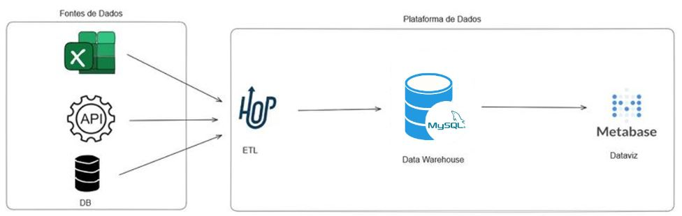

## 02. Preparação do Ambiente
Passo-a-passo detalhado: [Projeto Hopbase](https://hotmart.com/pt-BR/club/formacao-pentarruda/products/5599808/content/r488xZ2n4R?track=Pb4K0mLbeX).

### 📌 Banco de Dados
Uniserver: Banco de Dados MySQL. <br>
Unicontroller: Software para ativar o banco de dados. <br>
HeidiSQL: IDE para desenvolvimento. <br>

### 📌 Java
Criar variável de ambiente (JAVA_HOME).

### 📌 Apache Hop (Hop Orchestration Platform)
É uma plataforma de código aberto voltada para a engenharia, integração e orquestração de dados e metadados. <br>
Instalar o software [Apache Hop](https://hop.apache.org/download/). <br>
Realizar conexão do Apache Hop com o Banco de Dados (Drive de conexão do MySQL).

### 📌 Metabase
Ferramenta de Business Intelligence (BI) e análise de dados de código aberto (open source). Permite conectar com bancos de dados e criar gráficos, métricas e painéis visuais (dashboards). <br>
Instalar o software [Metabase](https://www.metabase.com/docs/latest/installation-and-operation/running-the-metabase-jar-file
). <br>
Seguir orientações da documentação do Metabase.

### 📌 SQL Power Architect
Ferramenta gráfica e de código aberto voltada para a **modelagem de bancos de dados e design de Data Warehouses**. <br>
Instalar o software SQL Power Architect.

### 📌 Resumo Tecnologias
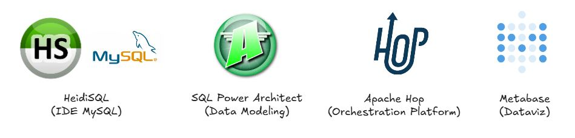

## 03. Banco de Dados do Projeto: "north"
📝 Criar Banco de Dados (north) no HeidiSQL ("Rodar" arquivo DDL.sql). <br>
📝 Também foi criado os BDs: dev, qa, prod. <br>
📝 Ilustração BD north abaixo (12 tabelas): <br>
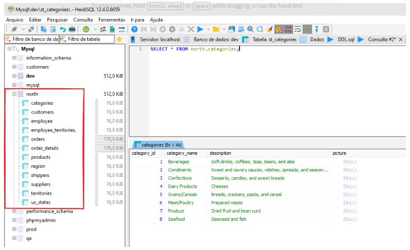

## 04. Staging Area (Criação e Carga de dados)
📝 Através do SQL Power Architect, foram criadas as tabelas da camada STAGING, no banco de dados "dev". <br>
📝 Documentação das tabelas da camada STAGING, gerado através do SQL Power Architect:
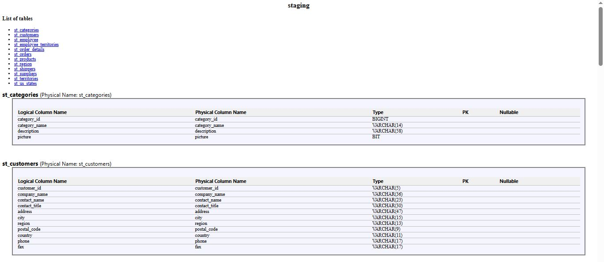
📝 Apache Hop: Desenvolvimento dos PIPELINES para carga de dados de cada tabela na camada STAGING. <br>
📝 Apache Hop: Desenvolvimento de WORKFLOW para carga completa e simultânea dos dados na camada STAGING. <br>
PIPELINES
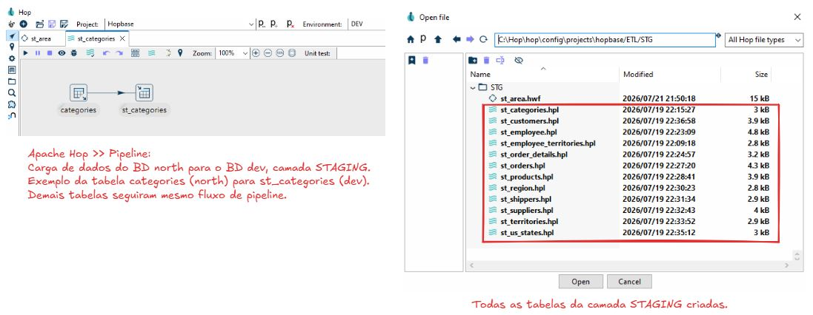 <br> 
WORKFLOW
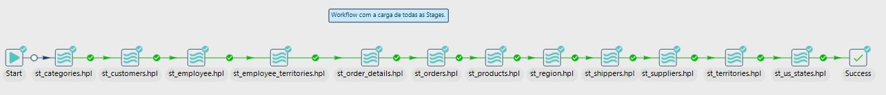 <br>

## 05. Data Warehouse (DW)
📝 MySQL / HeidiSQL: Desenvolvimento da tabela FATO ft_orders (INNER JOIN entre as tabelas dev.st_orders & dev.st_order_details) <br>

```
SELECT
	o.order_id,
	o.customer_id AS sk_customer,
	o.employee_id AS sk_employee,
	od.product_id AS sk_product,
	o.order_date,
	o.required_date,
	o.shipped_date,
	od.unit_price,
	od.quantity,
	od.discount,
	ROUND(od.unit_price * od.quantity, 2) AS valor_bruto,
	ROUND((od.unit_price * od.quantity) * od.discount, 2) AS valor_desconto,
	ROUND((od.unit_price * od.quantity) - ((od.unit_price * od.quantity) * od.discount), 2) AS valor_liquido
FROM dev.st_orders o
INNER JOIN dev.st_order_details od
ON o.order_id = od.order_id;
```

📝 Através do SQL Power Architect, foram criadas as tabelas DIMENSÕES e FATO da camada DW, no banco de dados "dev". <br>
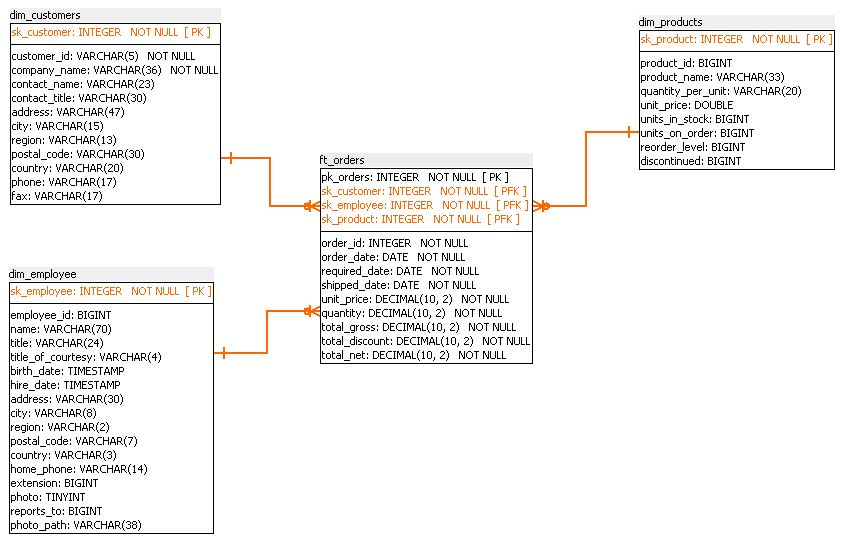

📝 Documentação das tabelas da camada DW, gerado através do SQL Power Architect:
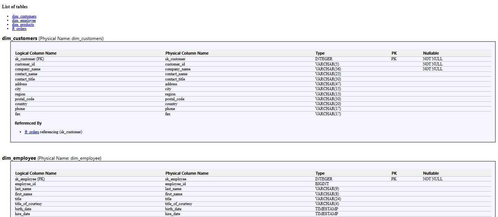

🌟 Dimensão dim_customer <br>
Para a dim_customer, será apresentado 02 abordagens para carga dos dados: <br>
Carga Full x Carga SCD2 (Slowly Changing Dimension Tipo 2) <br>

✅ **Carga Full (Carga Completa):** Apaga e substitui todos os dados antigos a cada atualização. <br>

**Pipeline para carga full (Apache Hop)** <br>
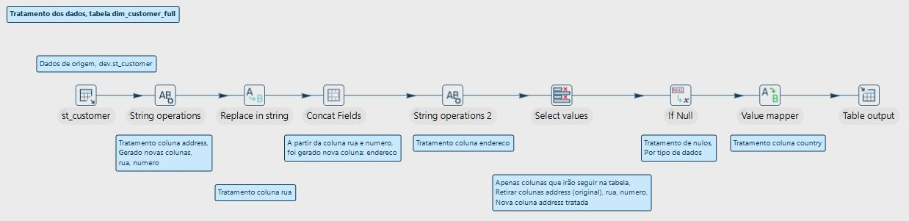

✅ **Carga SCD2:** Método de modelagem de dados usado para guardar o histórico de alterações em tabelas dimensionais. <br>

1ª Etapa: Simulando atualização no bd produção (north), tabela customers. <br>
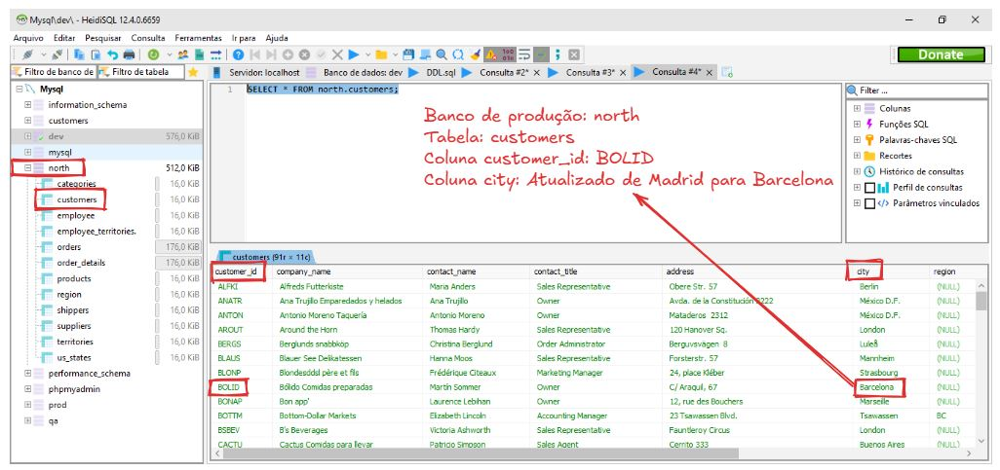 <br>

2ª Etapa: Executar o workflow no apache hop st_area (Workflow com a carga de todas as stages). <br>
 <br>

3ª Etapa: **Pipeline para carga scd2 (Apache Hop)** <br>
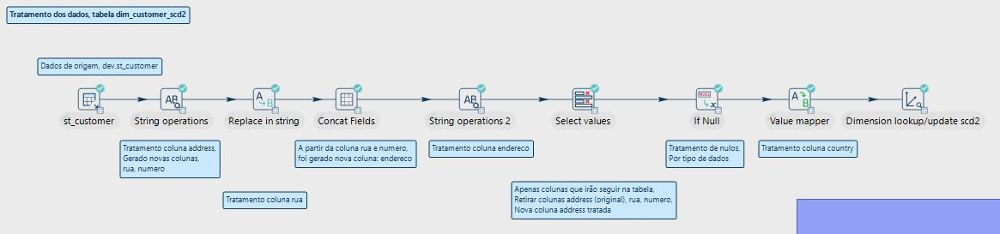 <br>

🌟 Dimensão dim_employee <br>
**Pipeline para carga full (Apache Hop)** <br>
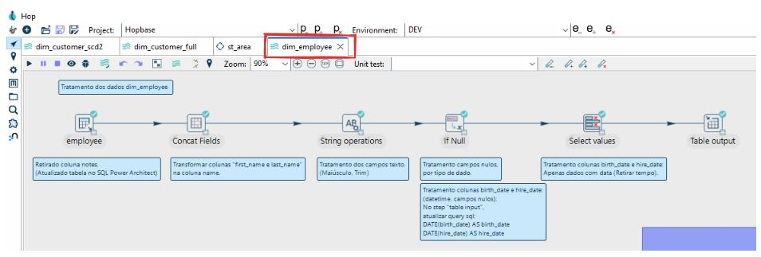 <br>

🌟 Dimensão dim_products <br>
**Pipeline para carga full (Apache Hop)** <br>
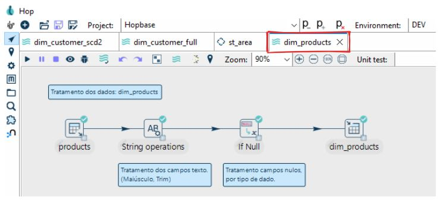 <br>

🌟 Dimensão dim_calendario <br>
Tabela desenvolvida no Apache Hop. <br>
**Pipeline para carga full (Apache Hop)** <br>
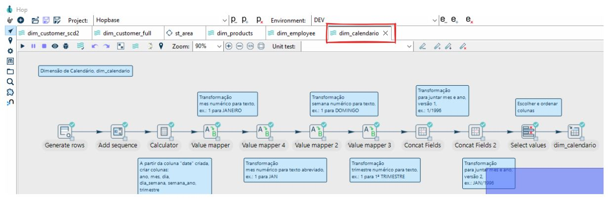 <br>

📝 Obs. Staging Area: Implementar a Staging da Tabela FATO. <br>
Através do SQL Power Architect, foi criada a tabela FATO na camada STAGING, st_fato_orders, no banco de dados "dev". <br>
Para suportar a tabela na camada DW, ft_orders. <br>
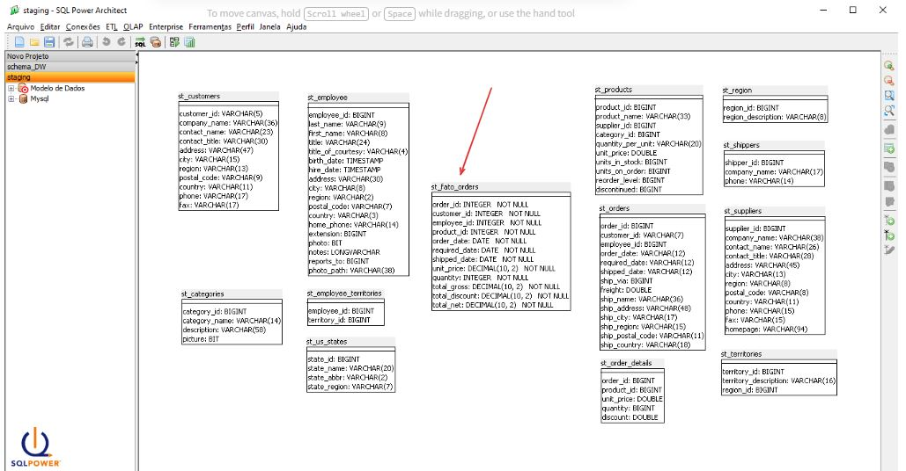

📝 Apache Hop: Desenvolvimento do PIPELINE para carga de dados da tabela st_fato_orders na camada STAGING. <br>
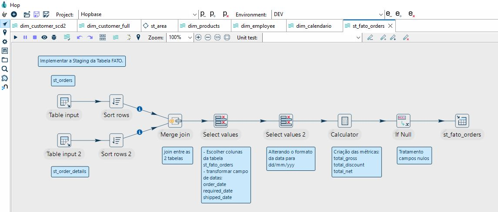

🌟 Tabela fato_orders <br>
Tabela desenvolvida no Apache Hop. <br>
(Lookups tabela st_fato_orders com: dim_customer_scd2, dim_employee, dim_products, dim_calendario. Para trazer as colunas sk's). <br>
**Pipeline para carga full (Apache Hop)** <br>
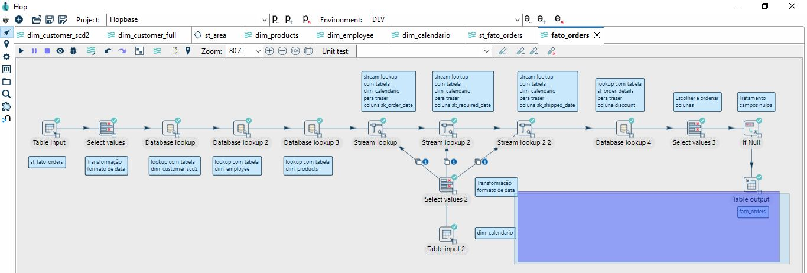 <br>

Modelagem DW atualizada: <br>
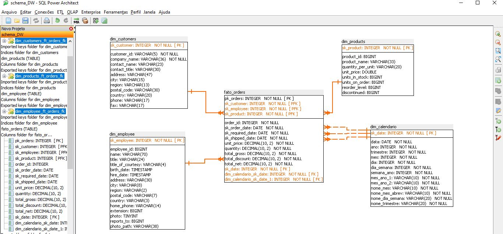 <br>

### CARGA INCREMENTAL

🌟 Dimensão dim_products <br>
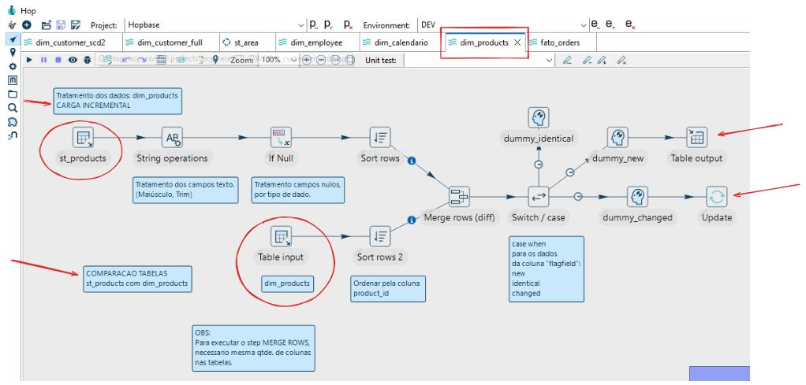

📝 Simulação alteração de dado. Alteração no BD de produção, tabela products, coluna units_in_stock (north.products). <br> 
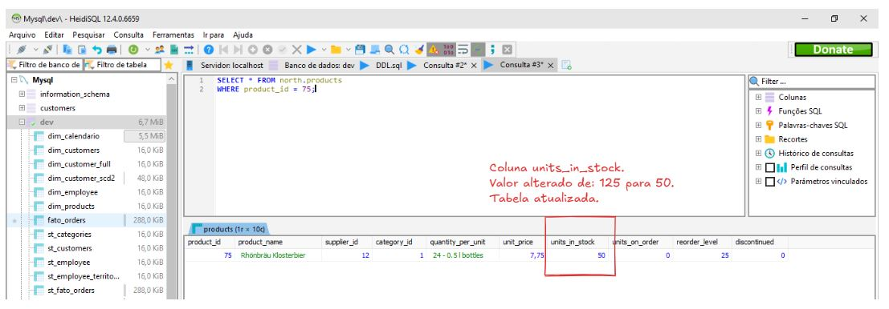

📝 Apache Hop: Rodar o WORKFLOW staging area (st_area). <br>
📝 Apache Hop: Rodar o PIPELINE dim_products (carga_incremental). <br>
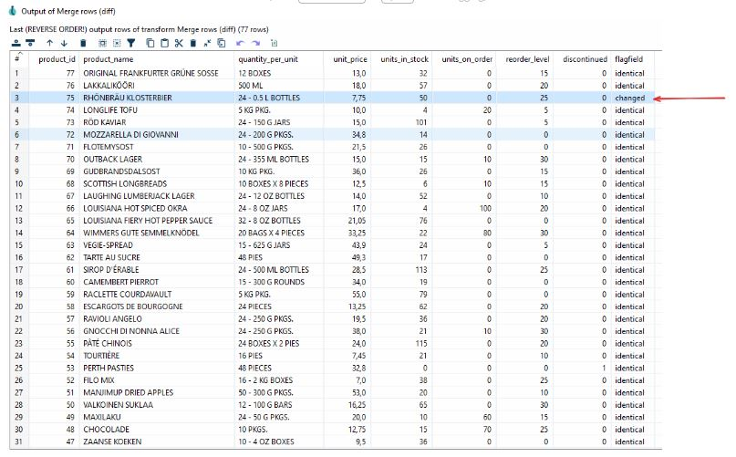

🌟 Dimensão dim_employee <br>
Outro método para carga incremental, utilizando apenas o step Synchronize after merge. <br>
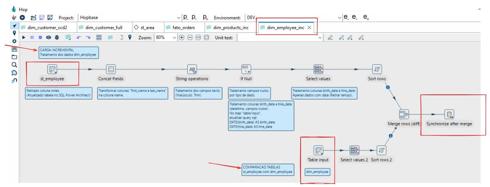

🌟 Dimensão dim_calendario_dinamica <br>
Outra forma para desenvolvimento da dim_calendario. <br>
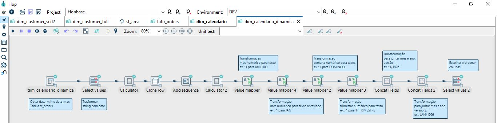

🌟 Dimensão dim_customer_scd2 <br>
Concluída na seção anterior.

### AJUSTANDO DOCUMENTAÇÃO DO DATA WAREHOUSE (DW) 

📝 Atualizando informações das tabelas DIMENSÃO na ferramenta SQL Power Architect.
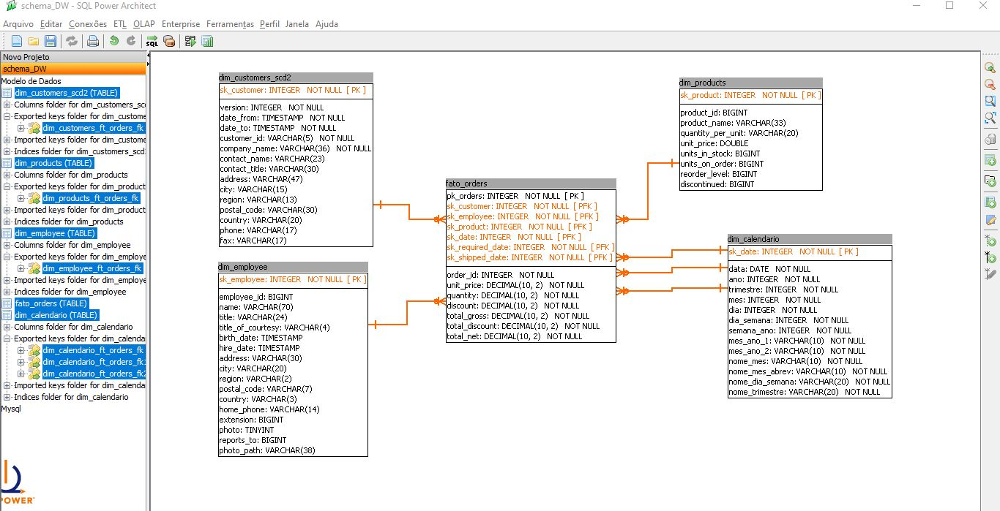

📝 Criar WORKFLOW das tabelas dimensões. 
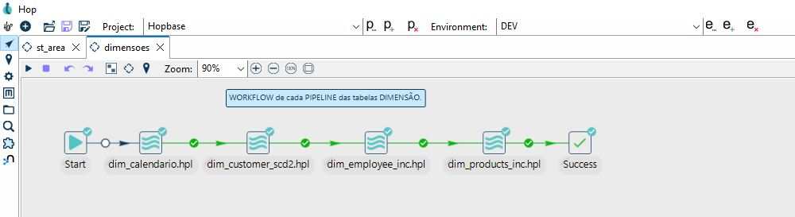

📝 Criar WORKFLOW da tabela fato.
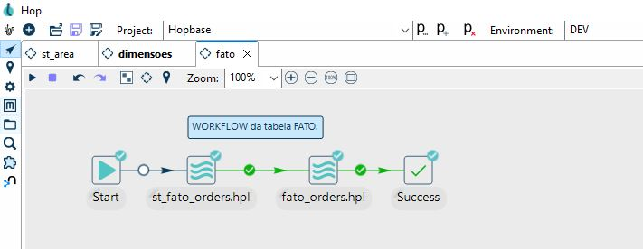

📝 WORKFLOW geral para o DW.
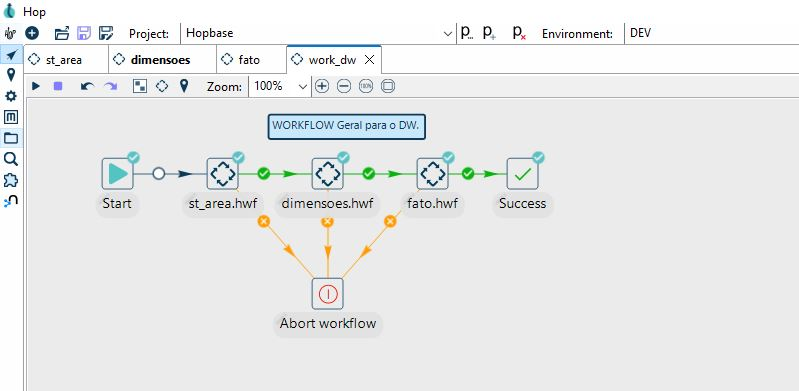
